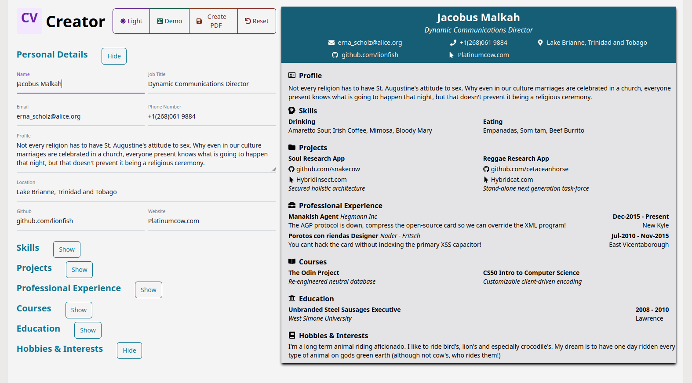

# CV-Creator

A CV creator app with a modular design. Built using React & Tailwind, packaged with Vite.

[Demo here](https://cascvcreator.netlify.app/)



### Installing and running locally

```bash
git clone git@github.com:Casssb/cv-creator.git
cd cv-creator
npm install
npm run dev
```

## Tech Used
* React, Tailwind
* NPM & Vite for build
* Falso (for moc data)
* React-Icons (for, wait for it...icons)
* Uniqid (to generate keys for map() calls)
* Jspdf & html2canvas (for converting the display section to PDF)

## Features
* Designed from the ground up to be modular (only add the sections you need)
* Light & dark mode options
* Responsive on PC, Tablet & Mobile
* An option to save a PDF copy
* A 'demo' option which fills the form with moc data

## Thoughts
My goal when designing this app was to make it modular. My own journey through learning web development has led me to reflect on the different type of CV users may want to build. A self-taught dev would likely want to build a larger section emphasising personal projects and courses. Somebody with a computer science background may want to take a different option. 

Trying to achieve this in React was way easier than I anticipated. React (so far) has been a pleasure when adopting a composable, modular approach to structuring. Having looked back at the wireframes from my previous few projects I think this way of coding has always been my goal. Now that I've used React (and tried out frameworks a little like Angular and Astro) I don't think I'll ever go back to structuring my code using Vanilla JS IIFE's and pub/sub libraries. There was a particular moment where i was 90% of the way through finishing the app and I realising I'd missed adding a section to the form. I had a moment of panic thinking I'd have to restructure and then realised I'd already made that part of the code expandable. I simply added another component to the form section and gave it a prop and was good to go!

Oh, and if anyone actually reads this and tries out my app, please click the 'demo' button a few times and get some samples of the wonderful moc data Falso provides! 

## Possible Improvements
* There is a small bug with the way the PDF conversion logic works. The logic compares the height/width values and since the height of the component is dynamic, it builds PDF with extra white-space at the bottom. It also doesn't seem to take 'align-items' into account (although the docs say this should be accounted for).
* I'm considering changing the way the display component works on smaller devices. I've currently set it to switch to flex-column but if the user has a highly detailed form this can make it a chore to scroll up to the top. I may add a toggle button that will switch the view between 'form' mode and 'display' mode (and maybe make it sticky).
* I've tried to use React in the way it was intended and make as many composable elements as I can to save repeating code. There are a few areas where I could maybe make it more composable (like the links part). With the links section I needed the state to remain in the common parent component and since I was using a library to chose the images I thought it was better to leave the code as is. I could have added a switch statement with the image name and then passed this as a prop (making a new module for the links).
* I'm not 100% happy with the styling of the display. I wanted all the info to be succinct and displayed clearly but I have seen other CV builders online display it in a more aesthetically pleasing way. I may come back to this as I've built it in a way that changing the styles should be pretty straightforward.